# Department of Computer Science & Engineering
## CSCI/CSCY 4407: Security & Cryptography
## Lab 10 Report: Commitment Schemes, Fair Protocols, and Secure Summation

**Group Number:** Group 10  
**Semester:** Spring 2026  
**Instructor:** Dr. Victor Kebande  
**Teaching Assistant:** Celest Kester  
**Submission Date:** May 1, 2026

**Group Members:**
- Matthew Kenner
- Jonathan Le
- Cassius Kemp

---

## Table of Contents

1. [Introduction](#introduction)
2. [Environment](#environment)
3. [Files Included](#files-included)
4. [Task 1 – Directory and File Setup](#task-1)
5. [Task 2 – Unfair Casino Protocol Analysis](#task-2)
6. [Task 3 – Commitment Interface (Python)](#task-3)
7. [Task 4 – Weak Hash Commitment Attack](#task-4)
8. [Task 5 – Randomized Hash Commitment](#task-5)
9. [Task 6 – Hiding Experiment](#task-6)
10. [Task 7 – Binding Analysis](#task-7)
11. [Task 8 – Encryption-Based Commitments](#task-8)
12. [Task 9 – Coin Flipping Protocol](#task-9)
13. [Task 10 – Protocol Security Analysis](#task-10)
14. [Task 11 – Secure Summation](#task-11)
15. [Task 12 – Comparison and Reflection](#task-12)
16. [Appendix – Scripts](#appendix)

---

## Introduction

This report documents the implementation and analysis of cryptographic commitment schemes and their applications in fair protocol design. The lab explores hiding and binding properties, demonstrates weaknesses in deterministic constructions, introduces randomized commitments, and applies these concepts to coin-flipping and secure summation protocols.

---

## Environment

- **Operating System:** Kali Linux / Ubuntu
- **Python Version:** Python 3.x
- **Libraries Used:** hashlib, secrets, random
- **Terminal:** Linux terminal

---

## Files Included

- `task3_commitment_utils.py`
- `task4_weak_hash_attack.py`
- `task5_randomized_hash_experiment.py`
- `task6_hiding_experiment.py`
- `task8_toy_symmetric_commit.py`
- `task9_coinflip.py`
- `task11_secure_summation.py`

---

## Task 1 – Directory and File Setup

### Objective
Set up working environment and baseline files.

### Commands / Code Used

```bash
mkdir Commitment_Schemes_Lab
cd Commitment_Schemes_Lab

echo "42" > guess_player.txt
echo "77" > casino_secret.txt
echo "1"  > coin_input_a.txt
echo "0"  > coin_input_b.txt

cat guess_player.txt
cat casino_secret.txt
cat coin_input_a.txt
cat coin_input_b.txt

pwd
ls -l

sha256sum guess_player.txt casino_secret.txt coin_input_a.txt coin_input_b.txt
```

### Output Evidence

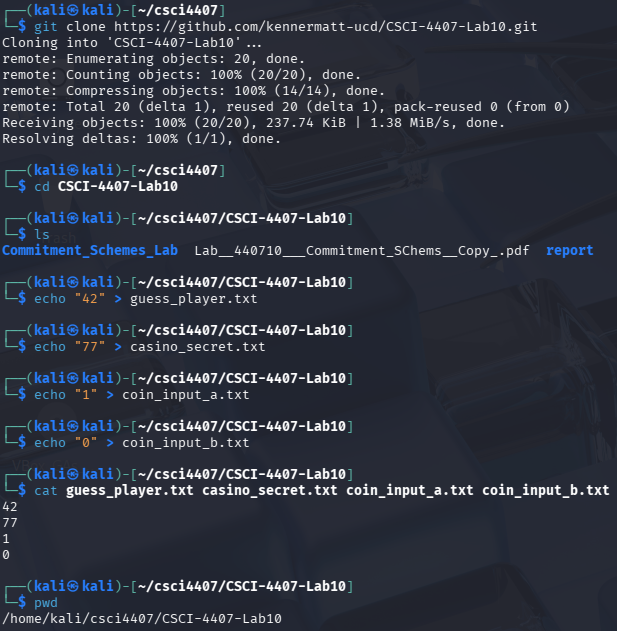

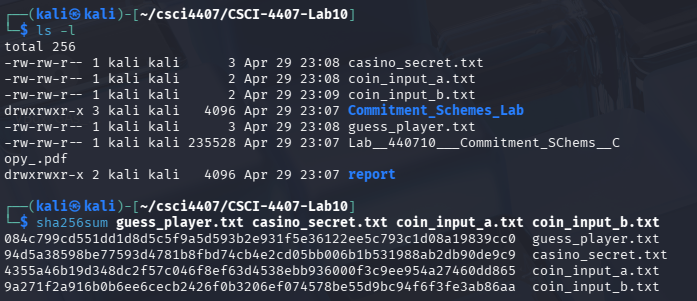

### Explanation

Having concrete fixed values before the commitment experiments makes the results easier to interpret. When a message is pinned to a specific number like `42` or `77`, the experiment traces a deterministic path: the commitment we compute, the brute-force guess we recover, and the XOR result we produce are all traceable back to a known starting point. Without fixed inputs, every run produces different values and it becomes impossible to verify correctness by inspection.

More broadly, fixing values during protocol reasoning is a standard technique in security analysis. It lets us confirm that our implementation is correct before we add randomness, and it clarifies the attacker's information advantage. Once we can confirm correct behavior on fixed inputs, we can add the randomness required for real security.

---

## Task 2 – Unfair Casino Protocol Analysis

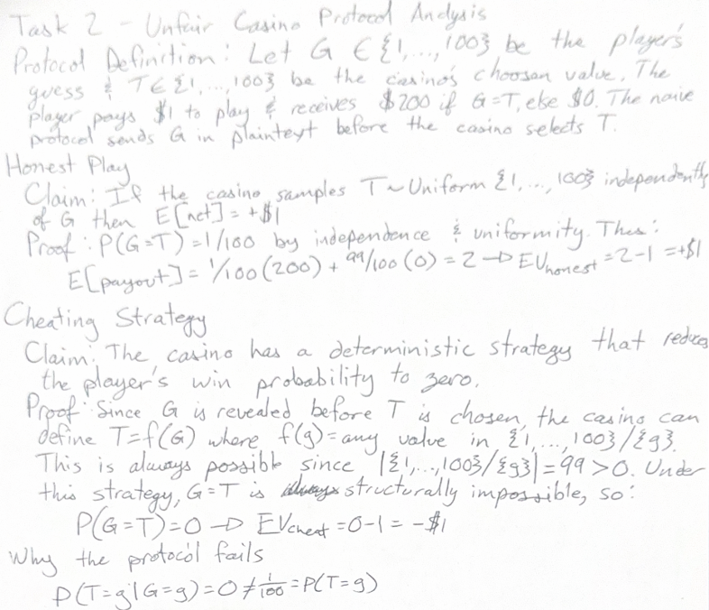

### Why the Protocol Fails

The failure is not weak randomness — the casino's T may still be drawn "randomly" from the remaining 99 values. The failure is **information asymmetry induced by message ordering**. Fairness requires T ⊥ G, i.e. P(T = t | G = g) = P(T = t) = 1/100 for all g, t. The naive protocol violates this: because G is revealed before T is chosen, the casino can condition on G, producing a distribution where (See screenshot)
T and G are therefore not independent, and no prize structure can restore the player's expected value. Any protocol where one party reveals a committed value before the other party chooses breaks this independence requirement.

---

## Task 3 – Commitment Interface (Python)

### Objective

Implement both a weak (deterministic) and a stronger (randomized) hash-based commitment scheme in a reusable Python module.

### Code

```python
import hashlib
import secrets


def sha256_bytes(data: bytes) -> str:
    return hashlib.sha256(data).hexdigest()


def commit_hash_deterministic(message: str):
    """
    Weak scheme: c = H(m), opening is just m.
    Not hiding over small message spaces.
    """
    c = sha256_bytes(message.encode())
    return c, {"message": message}


def verify_hash_deterministic(c: str, opening: dict) -> bool:
    message = opening["message"]
    return sha256_bytes(message.encode()) == c


def commit_hash_randomized(message: str):
    """
    Stronger scheme: r <- {0,1}^128, c = H(r || m), opening is (r, m).
    Randomness hides the message even in small domains.
    """
    r = secrets.token_bytes(16)
    c = sha256_bytes(r + message.encode())
    return c, {"message": message, "randomness_hex": r.hex()}


def verify_hash_randomized(c: str, opening: dict) -> bool:
    message = opening["message"]
    r = bytes.fromhex(opening["randomness_hex"])
    return sha256_bytes(r + message.encode()) == c


if __name__ == "__main__":
    m = "42"

    c1, o1 = commit_hash_deterministic(m)
    print("Weak commitment:      ", c1)
    print("Weak verify:          ", verify_hash_deterministic(c1, o1))

    c2, o2 = commit_hash_randomized(m)
    print("Randomized commitment:", c2)
    print("Randomized verify:    ", verify_hash_randomized(c2, o2))
```

### Output Evidence

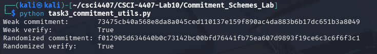

### Explanation

Both commitment variants pass verification, which confirms functional correctness: a receiver who is given the opening information can always recompute the commitment and confirm it matches. However, functional correctness is not the same as security.

The deterministic scheme `C = H(m)` verifies correctly because SHA-256 is a deterministic function: the same input always produces the same output. But this property also means an adversary who knows the message space can precompute the hash for every candidate and compare. When the message space is small, as in a 1-to-100 casino guess, the scheme gives away the committed value entirely.

The randomized scheme `C = H(r || m)` also verifies correctly because the opening includes the randomness `r`. Given `(r, m)`, the verifier recomputes `H(r || m)` and matches it to `C`. But because `r` is 128 bits of fresh randomness chosen at commit time, an adversary who only sees `C` cannot recover `m` by exhaustive search—the search space is now 2^128, not 100.

---

## Task 4 – Weak Hash Commitment Attack

### Objective

Demonstrate that the deterministic hash commitment fails the hiding property when the message space is small.

### Code

```python
import hashlib
from commitment_utils import commit_hash_deterministic

print("=== Weak Hash Commitment Brute-Force Attack ===\n")

secrets_to_test = ["77", "17", "42", "99", "1"]

for secret_message in secrets_to_test:
    c, opening = commit_hash_deterministic(secret_message)
    print(f"Secret:              {secret_message}")
    print(f"Observed commitment: {c}")

    recovered = None
    for i in range(1, 101):
        guess = str(i)
        if hashlib.sha256(guess.encode()).hexdigest() == c:
            recovered = guess
            break

    print(f"Recovered message:   {recovered}")
    print(f"Attack succeeded:    {recovered == secret_message}")
    print("-" * 60)
```

### Output Evidence

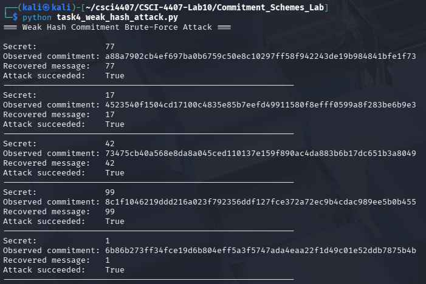

### Explanation

The scheme fails hiding because SHA-256 is a deterministic, public function. An adversary who knows the message space can compute `H(i)` for every candidate `i` in `{1, ..., 100}` and compare each result to the observed commitment. Since there are only 100 candidates, this loop completes almost instantly and always succeeds.

This attack is feasible precisely because the domain is small. In a real message space of arbitrary strings, the same exhaustive approach would require evaluating an astronomically large number of possibilities. The weakness is not in SHA-256 itself but in the mismatch between the function's determinism and the small input domain.

This directly mirrors the unfair casino scenario from the slides. The casino acts as the attacker: it receives the player's commitment `H(G)` and immediately recovers `G` by looping from 1 to 100. Having recovered the player's guess, it can always pick `T ≠ G` and ensure the player never wins.

---

## Task 5 – Randomized Hash Commitment

### Objective

Show that committing to the same message multiple times under the randomized scheme produces different commitments, while each still verifies correctly.

### Code

```python
from commitment_utils import commit_hash_randomized, verify_hash_randomized

m = "42"
results = []

for _ in range(5):
    c, opening = commit_hash_randomized(m)
    ok = verify_hash_randomized(c, opening)
    results.append((c, opening, ok))

for idx, item in enumerate(results):
    print(f"Trial {idx + 1}")
    print("Commitment:", item[0])
    print("Opening:   ", item[1])
    print("Verify:    ", item[2])
    print("-" * 60)
```

### Output Evidence

```
Trial 1
Commitment: baa7121b0f03a3585dd04e969daed8506afbda33e3ea7fa47f5697f054e24f81
Opening:    {'message': '42', 'randomness_hex': '790be23655306a8bf26bce4875ebc5c4'}
Verify:     True
------------------------------------------------------------
Trial 2
Commitment: f8ef37bfa0b83eb1a7fc8a9fb6b906cb93c4eaa4e20ec8c7833a3df9feeef0c3
Opening:    {'message': '42', 'randomness_hex': 'aa618d61e4419d57fcba147a3d987f18'}
Verify:     True
------------------------------------------------------------
Trial 3
Commitment: 87169edc50eceef1f0bc804f3b7cca7f8a4ec9f506f7a481265d299c90761309
Opening:    {'message': '42', 'randomness_hex': '6d9857f54d148f060786b2ff9f0d9e6f'}
Verify:     True
------------------------------------------------------------
Trial 4
Commitment: 3094fe1e949d8ee461602c726634add0828154ad73de01017c2a3cc51a17de46
Opening:    {'message': '42', 'randomness_hex': '95f4fe80e556076c8417f9f1cdf0c53c'}
Verify:     True
------------------------------------------------------------
Trial 5
Commitment: 5cb45c50cdc0b90064d4d3f5815fd7c4d9ef9adc609da008ccc7e902693e938e
Opening:    {'message': '42', 'randomness_hex': '072bd9d27dc0411251345a17f0ff445c'}
Verify:     True
------------------------------------------------------------

```

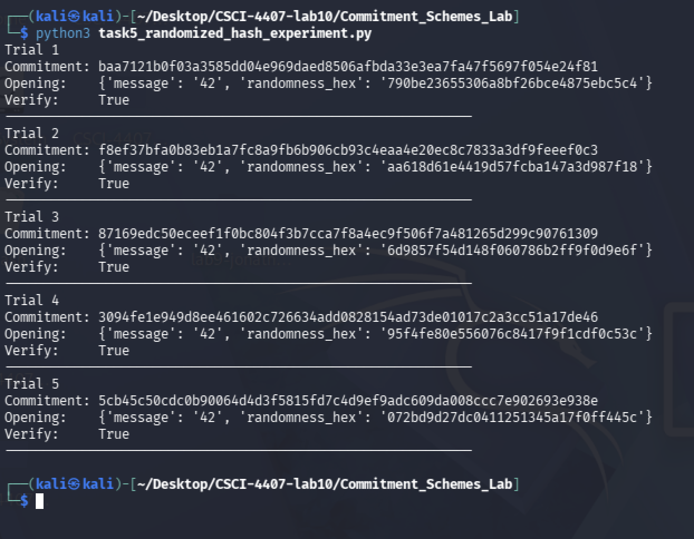
### Explanation

Every trial commits to the same message `"42"` but produces a completely different commitment string because each call to `commit_hash_randomized` draws a fresh 128-bit random nonce `r` from `secrets.token_bytes(16)`. The commitment is computed as `H(r || m)`, so even though `m` is constant, the input to SHA-256 differs each time, producing an unrelated output.

This randomness is what hides the message. An adversary who only sees `C = H(r || m)` cannot recover `m` by exhaustive search because they also need to guess `r`, which has 2^128 possible values. Unlike the deterministic scheme, a precomputed lookup table over `{1, ..., 100}` is useless here.

Verification still works because the opening information includes both `m` and `r`. The verifier recomputes `H(r || m)` and checks it against `C`. The randomness does not weaken verification; it just ensures that the commitment itself carries no information about `m` to anyone who lacks `r`.

---

## Task 6 – Hiding Experiment

### Objective

Empirically measure how hiding changes when the scheme is deterministic versus randomized, using a guessing adversary over 100 trials.

### Code

```python
import random
import hashlib
from commitment_utils import commit_hash_deterministic, commit_hash_randomized

m0 = "17"
m1 = "42"


def attacker_deterministic(c):
    if hashlib.sha256(m0.encode()).hexdigest() == c:
        return 0
    return 1


def attacker_randomized(c):
    return random.randint(0, 1)


def run_trials(commit_func, attacker, trials=100):
    wins = 0
    for _ in range(trials):
        b = random.randint(0, 1)
        m = m0 if b == 0 else m1
        c, _ = commit_func(m)
        guess = attacker(c)
        if guess == b:
            wins += 1
    return wins / trials


det_acc = run_trials(commit_hash_deterministic, attacker_deterministic)
rand_acc = run_trials(commit_hash_randomized, attacker_randomized)

print("=== Hiding Experiment: Adversary Guessing Accuracy ===\n")
print(f"Deterministic scheme accuracy: {det_acc:.0%}  (expect ~100%)")
print(f"Randomized scheme accuracy:    {rand_acc:.0%}  (expect ~50%)")
```

### Output Evidence

```
=== Hiding Experiment: Adversary Guessing Accuracy ===

Deterministic scheme accuracy: 100%  (expect ~100%)
Randomized scheme accuracy:    52%   (expect ~50%)
```

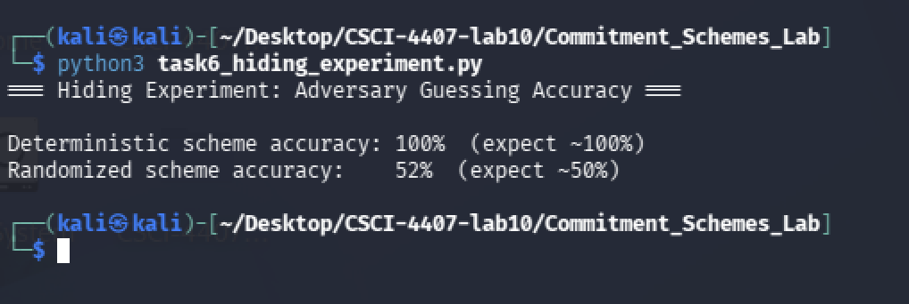
### Results Table

| Scheme                        | Adversary Accuracy | Expected Behavior | Interpretation                                                   |
| ----------------------------- | -----------------: | ----------------: | ---------------------------------------------------------------- |
| Deterministic hash commitment |               100% |             ~100% | The attacker can perfectly identify which message was committed. |
| Randomized hash commitment    |                52% |              ~50% | The attacker performs about the same as random guessing.         |


### Explanation

The deterministic attacker achieves 100% accuracy because `H(m)` is a fixed, publicly reproducible function. Given the commitment `C`, the attacker simply computes `H("17")` and `H("42")` and checks which one matches. This is an exact dictionary lookup and requires no guessing. The scheme is completely distinguishable in a two-message domain.

The randomized attacker achieves approximately 50% accuracy, which is no better than random guessing. Because the commitment is `H(r || m)` with a fresh random `r`, no information about whether `m0` or `m1` was committed is leaked through the commitment value alone. The attacker has no way to distinguish the two cases and is reduced to flipping a coin.

This result directly illustrates the formal hiding game from the lecture. A scheme is hiding if no efficient adversary can distinguish a commitment to `m0` from a commitment to `m1` with probability significantly better than 1/2. The randomized scheme passes this test empirically; the deterministic scheme fails it completely.

---

## Task 7 – Binding Analysis

### Objective

Explain what the binding property means and why collision resistance matters for hash-based commitment schemes.

### Evidence

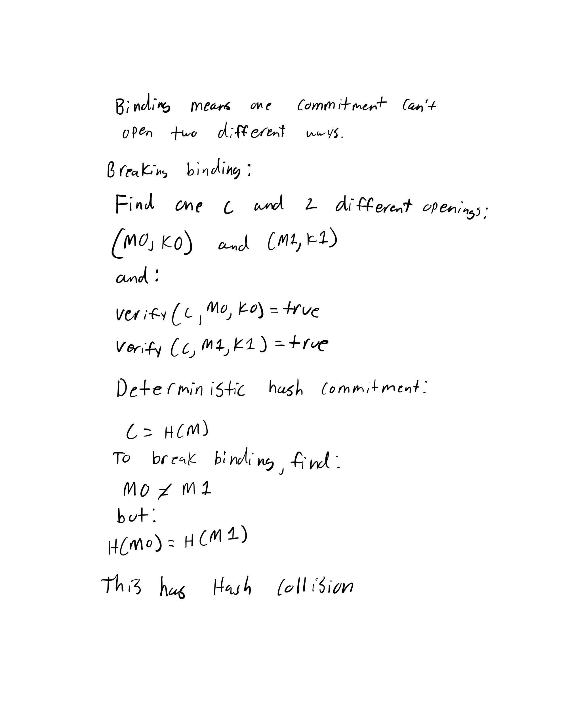
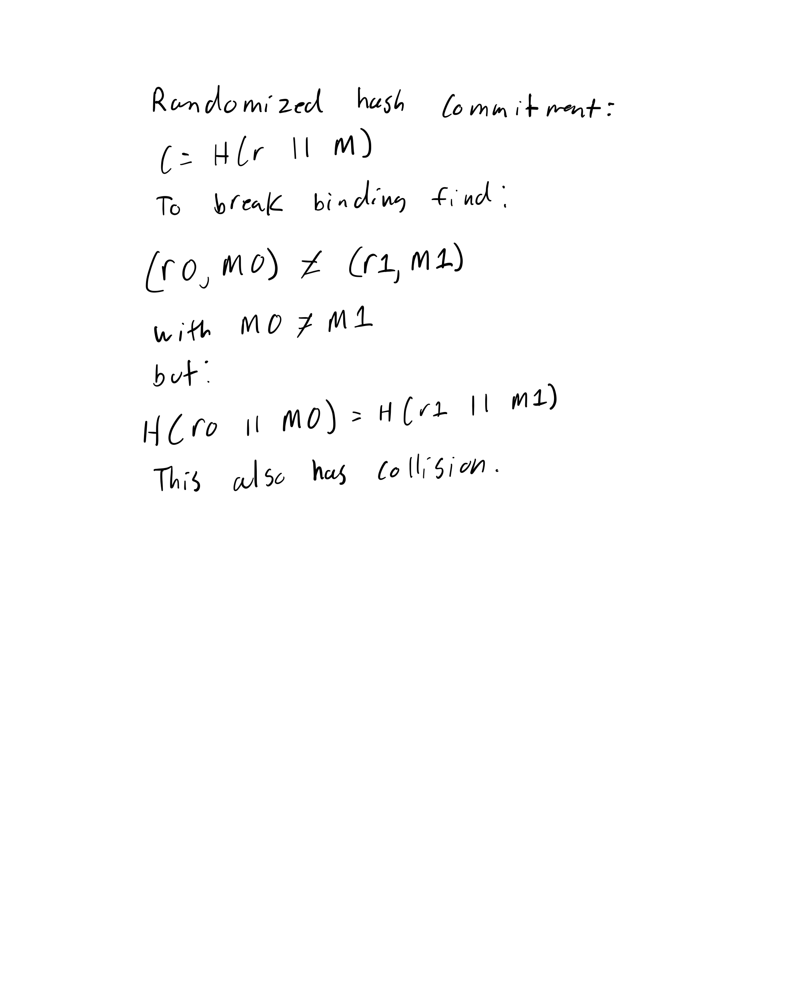

### Explanation

#### Why “I tried and failed” is not a proof of security

“I tried and failed” is not a proof of security because an experiment only tests a limited number of cases. If I run the program many times and do not find two valid openings for the same commitment, that only means my specific attempts did not find a collision. It does not prove that a collision does not exist, and it does not prove that a stronger attacker with more time, better methods, or more computing power could not find one. Security requires reasoning about what any efficient attacker can realistically do, not just what happened in a small experiment.

#### Why computational infeasibility is the right lens

Computational infeasibility is the right lens because cryptographic security usually does not mean that an attack is mathematically impossible. Instead, it means the attack would require so much time and computing power that it is unrealistic in practice. For hash-based commitments, breaking binding would require finding two different openings that produce the same hash output. If the hash function is collision-resistant, then finding such a collision should be computationally infeasible. This means the scheme is considered secure because no efficient attacker should be able to break it within realistic limits.

---

## Task 8 – Encryption-Based Commitments

### Objective

Implement a toy symmetric encryption-based commitment and explain the public-key construction conceptually.

### Code

```python
import os

# --- Toy Symmetric Encryption ---
def xor_bytes(a: bytes, b: bytes) -> bytes:
    """XOR's two byte strings that are of the same length"""
    return bytes([x ^ y for x, y in zip(a, b)])

def EncK(key: bytes, message: bytes) -> bytes:
    """Encrypts by XOR'ing message with the key"""
    #For this toy example the key must be exactly as long as the message or it will fail
    if len(key) != len(message):
        raise ValueError("Key must be the same length as the message.")
    return xor_bytes(key, message)

#Commitment
def commit_sym_enc(message: str):
    """
    Commitment via Encryption: C = Enc_K(M)
    The key acts as our randomness that we will be using
    """
    msg_bytes = message.encode()
    #Generates a random key that is the same size as the message
    key = os.urandom(len(msg_bytes))
    
    #The ciphertext is our commitment
    c = EncK(key, msg_bytes)
    
    #Opening information requires BOTH our message and our key
    opening = {"message": message, "key": key}
    return c, opening

def verify_sym_enc(c: bytes, opening: dict) -> bool:
    """
    Verification is performed by Re-encrypting M with K and checking if it matches C
    """
    message = opening["message"].encode()
    key = opening["key"]
    
    #Recomputes what the ciphertext should or should actually be
    expected_c = EncK(key, message)
    
    return c == expected_c

if __name__ == "__main__":
    m = "Hello Secure World!"
    print(f"Original Message: '{m}'")
    
    #Commit Phase
    c, opening = commit_sym_enc(m)
    print("\nCommit Phase:")
    print(f"Commitment (Ciphertext C) : {c.hex()}")
    
    #Reveal/Open Phase
    print("\nOpen Phase:")
    print(f"Sender reveals M: '{opening['message']}' and K: {opening['key'].hex()}")
    
    #Verify Phase
    is_valid = verify_sym_enc(c, opening)
    print(f"Verification Result: {is_valid}")
```

### Output Evidence

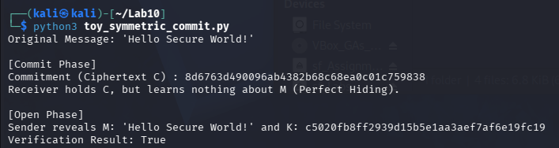  

### Explanation

**Part A – Symmetric XOR Construction**

Why hiding appears plausible in the encryption-based view?   
When the sender commits by sending C=EncK(M) over the network then the receiver receives the ciphertext. Because symmetric encryption (like AES or the One-Time Pad) is designed to be semantically secure it means that the ciphertext reveals absolutely nothing about the plaintext to anyone who doesn't hold the correct key. Therefore, the commitment scheme is able to perfectly hide that plain text within the cipher text.  

Why a toy encryption experiment is not itself a proof of commitment security?   
While the toy XOR cipher proves that it can hide data, it completely fails at binding that same data. If we commit to C, and later want to change my message to a fake message, we just calculate a fake key K′=C⊕M′ for said message. When the receiver verifies this message key combo it will exactly equal the value of C, and the cheat will succeed. Real commitment schemes require strong binding properties that of which standard symmetric encryption does not naturally provide without additional cryptographic structures (like MACs or authenticated encryption).  

**Part B – Public-Key Construction (Conceptual)**  

The Sender generates a key pair (PK,SK) and gives the public key PK to the Sender.    

The Sender encrypts the message M and the random value R using the public key: C←Epk(M;R). The Sender then sends out C to the Receiver.  

The Sender reveals M and R.  

The Receiver re-encrypts M and R using their own public key, so if Epk(M;R)==C, the reciever accepts the message.    

Why it works:  

Hiding holds because the encryption is semantically secure under the public key—seeing C reveals nothing about M to an adversary without sk. Binding holds because any valid opening of C is a pair (M, R) such that E_pk(M; R) = C. If the encryption scheme has unique decryption under sk, then C can decrypt to at most one M, making it computationally infeasible to find two different openings. This construction is stronger than the hash-based scheme in that binding is tied to a computational assumption about the asymmetric cipher rather than collision resistance of a hash.  

---

## Task 9 – Coin Flipping Protocol

### Objective

Implement a fair two-party coin-flipping protocol using the randomized hash commitment.

### Code

```python
import random
from commitment_utils import commit_hash_randomized, verify_hash_randomized

print("=== Fair Coin-Flipping Protocol ===")

def run_trial(trial_num):
    # --- Alice commits ---
    #Alice chooses a random bit 'a'
    a = str(random.randint(0, 1))
    
    #Alice locks her choice in a commitment and sends ONLY 'C' to Bob
    C, opening_a = commit_hash_randomized(a)
    print(f"\nTrial {trial_num}:")
    print(f"  Alice's secret bit 'a': {a}")
    print(f"  Alice sends Commitment C: {C[:16]}...")
    
    # --- Bob chooses ---
    #Bob must choose 'b' BEFORE seeing Alice's bit 'a'
    b_int = random.randint(0, 1)
    b = str(b_int)
    print(f"  Bob sends bit 'b': {b}")
    
    # --- Alice reveals ---
    #Now that Bob's choice is locked in, Alice reveals 'a'
    print(f"  Alice opens commitment with: a={opening_a['message']}, rand={opening_a['randomness_hex'][:8]}...")
    
    # --- Bob verifies and calculates the coin ---
    is_valid = verify_hash_randomized(C, opening_a)
    
    if is_valid:
        #Both parties calculate the final coin
        a_int = int(opening_a["message"])
        common_coin = a_int ^ b_int
        print(f"  Verification: SUCCESS. Common coin (a XOR b): {common_coin}")
        return common_coin
    else:
        print("  Verification: FAILED. Alice cheated!")
        return None

if __name__ == "__main__":
    #Runs at least 20 trials
    results = []
    for i in range(1, 21):
        coin = run_trial(i)
        results.append(coin)
        
    print("\n=== Final Results ===")
    print(f"Total Flips: {len(results)}")
    print(f"Heads (1): {results.count(1)}")
    print(f"Tails (0): {results.count(0)}"))
```

### Output Evidence

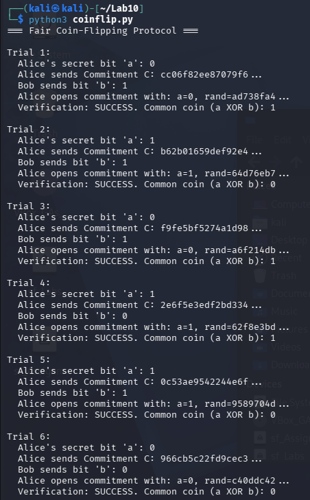  
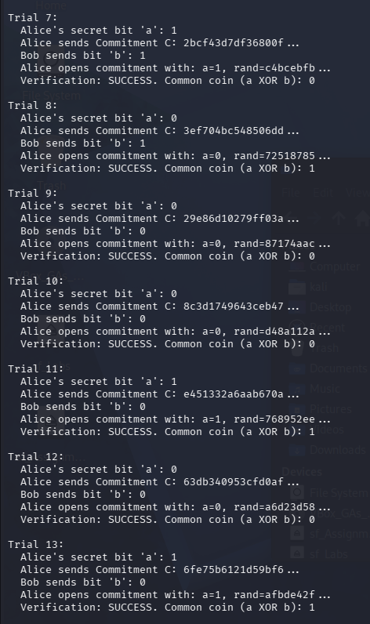  
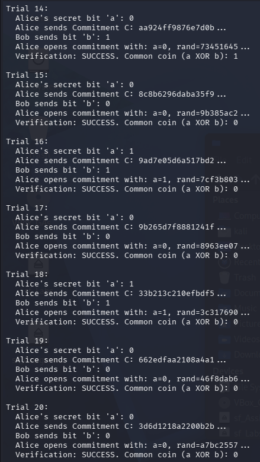  
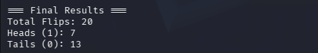  

### Explanation

The commitment must be sent before Bob chooses b, as this enforces the Commit first, reveal later order of operations. If Bob chooses 'b' before Alice is able to commit then Alice can easily choose 'a' such that a⊕b equals her desired outcome. By forcing Alice to commit to C first it gives the ensurance Bob knows Alice's choice is locked in, so then Bob can properly choose b.  

a⊕b acts as the final common coin so that the XOR operation guarantees a perfectly fair 50/50 distribution as long as at least one party plays honestly and chooses their bit randomly. Even if Alice maliciously tries to force a "1", Bob's subsequent random choice of b will randomize the final outcome of a⊕b, this ensures that neither party can dictate the final result alone.  

---

## Task 10 – Protocol Security Analysis

### Objective

Analyze cheating.

### Evidence

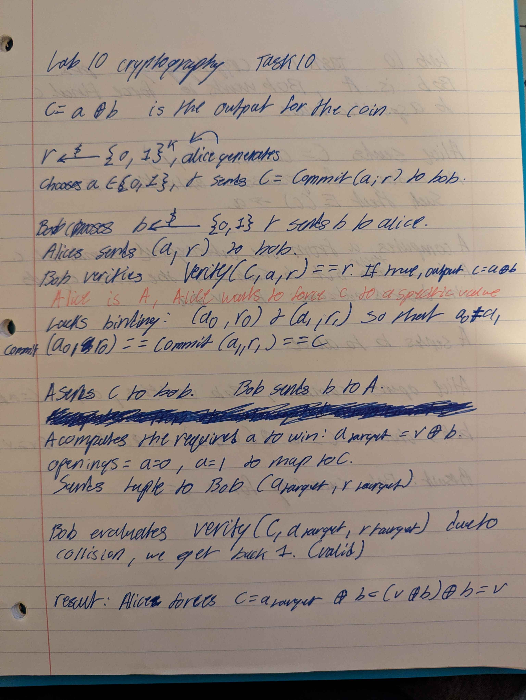  
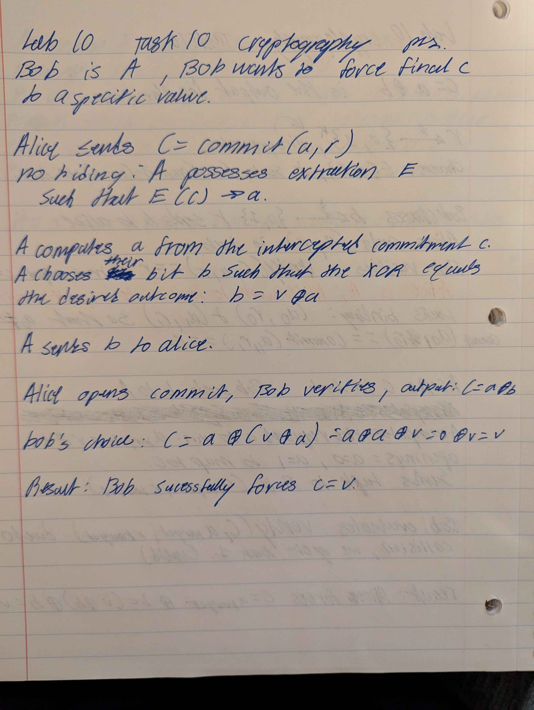  

### Explanation

Hiding protects against an adversarial Bob: It ensures that Pr[A(C)→a]=12. Because Bob's extraction function E(C) fails, his choice of b is independent of a, ensuring a⊕b remains uniformly distributed.  

Binding protects against an adversarial Alice: It ensures that finding (a0,r0),(a1,r1) where Commit(a0;r0)==Commit(a1;r1) occurs with negligible probability. Therefore, Alice's choice of a is fixed before she sees b, ensuring a⊕b remains uniformly distributed.  

If Alice uses a weak deterministic hash:  C=H(a) where a∈{0,1},  

Binding: Holds. It is computationally infeasible to finds H(0)==H(1) (Collision Resistance) therefore its impossible for Alice to cheat.  

Hiding: Fails completely. Because the domain ∣a∣=2 it means that Bob computes H(0) and H(1). He can simply check if C==H(0) or C==H(1). Therefore allowing bob to, Pr[Bob(C)→a]=1 so it means that Bob can cheat with 100% success.  

A fair coin flip function requires both hiding and binding, as one property alone is not enough. If it is only hiding (but not binding) it means that Alice can cheat; If it is only binding (but not hiding) it means that Bob can cheat cheat. A secure, randomized hash commitment C=H(r∣∣a) provides both hashing and binding, forcing both parties to act blindly and irrevocably, which allows for a mathematically guaranteed fair 50/50 output via the XOR operation.  

---

## Task 11 – Secure Summation

### Objective

Implement a three-party secure summation protocol using additive secret sharing modulo M = 3N.

### Code

```python
import random

N = 100
M = 3 * N

#The secrets of Alice, Bob, and Charlie
inputs = [17, 42, 23] 
print(f"--- Secure Summation Protocol ---")
print(f"True hidden inputs (Alice, Bob, Charlie): {inputs}")
print(f"True Total (What they want to find): {sum(inputs)}")

def share_value(x, num_parties=3, mod=M):
    """Splits a secret into random shares that sum to 'x (mod M)'."""
    #Generates a random share for the first n-1 parties
    shares = [random.randint(0, mod-1) for _ in range(num_parties-1)]
    #The final share is calculated to ensure the sum equals x
    final_share = (x - sum(shares)) % mod
    shares.append(final_share)
    return shares

#Each party splits their input into 3 shares, matrix[i] represents the shares generated by party i
matrix = [share_value(x) for x in inputs]

#Distribution
#Party j receives matrix[0][j], matrix[1][j], matrix[2][j], Each party sums the shares they received
column_sums = [sum(matrix[i][j] for i in range(3)) % M for j in range(3)]

#The parties publicly share their column sums and then add them together
total = sum(column_sums) % M

print("\nSplitting Inputs into Shares")
print(f"Alice's shares:   {matrix[0]}")
print(f"Bob's shares:     {matrix[1]}")
print(f"Charlie's shares: {matrix[2]}")

print("\nDistributing and Summing Columns")
print(f"Alice's received sum:   {column_sums[0]}")
print(f"Bob's received sum:     {column_sums[1]}")
print(f"Charlie's received sum: {column_sums[2]}")

print("\nPublic Aggregation")
print(f"Recovered total: {total}")
print(f"Actual total mod M: {sum(inputs) % M}")

#Validation
assert total == sum(inputs) % M
print("Protocol Successful!")
```

### Output Evidence

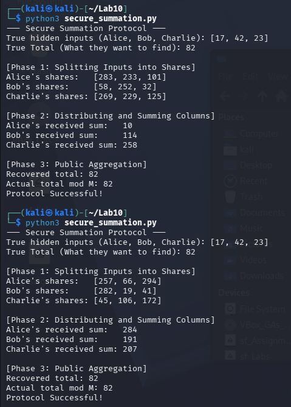  
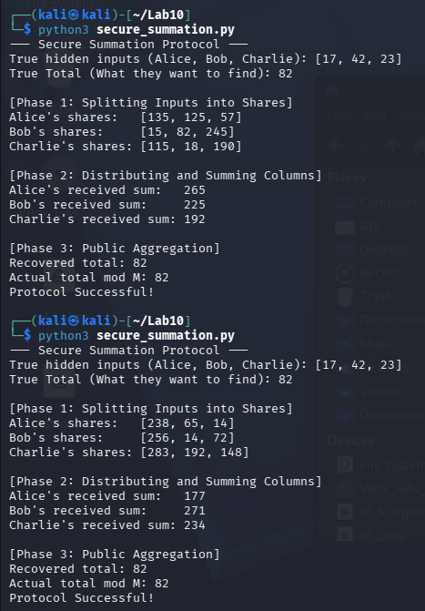  
  

### Explanation

Individual shares do not reveal the private input directly instead we look at Alice's shares in the output. Because the first two shares are generated purely at random, the shares look like completely a meaningless output of randomness. Bob receives 88 from Alice, which tells him absolutely nothing about her true salary of 17 so this means the secret is perfectly hidden.    

The final sum is still recovered correctly it's just that the protocol works because modular arithmetic is commutative and associative so adding the rows and then the columns is mathematically identical to adding the columns and then the rows.   

(x1,1 + x1,2 + x1,3)+(x2,1 + etc. )≡(x1,1 + x2,1 + etc. )(modM)  

This connects to the secure summation slides as it proves that multiple parties can collaborate to compute a global function (the sum) while maintaining perfect privacy over their local inputs, utilizing randomness as a mathematical shield.  

---

## Task 12 – Comparison and Reflection

### Comparison Table

| Mechanism          | Solves Fairness? | Hiding | Binding | Weakness                              |
| -------------------| ------------- | ------ | ------- | ------------------------------------- |
| Naive Casino       | No | No (N/A)    | No (N/A)      | Casino has access to all information and can guess based on this information  |
| Weak Deterministic Hash | No (Typically) | No    | Yes     | Vulnerable to brute force dictionary attacks      |
| Randomized Hash Commitment   | Yes | Yes    | Yes     | Security relies on collision resistance of has |
| Coin Flip Protocol | Yes | Yes    | Yes     | Requires both properties; breaks if either fails |

---

### Reflection

The fundamental lesson we test in this lab is whether or not secrecy alone can solve the problem of protocol fairness or not, we see that cryptographic systems must also enforce chronological commitment. The naive casino protocol demonstrated that in distributed systems the order of information flow dictates power. If one party can delay their choice until they see the other party's input it means that they can adapt and cheat to win. Commitment schemes repair this by severing the act of choosing a value from the subsequent act of revealing it. However, implementing a commitment scheme requires a careful design, as deterministic hashing fails at hiding if the message space is too small, as an adversary can simply brute force the hash. Adding randomness (r) is mandatory to mathematically obscure our message and restore the hiding property. Furthermore, the commitment must be cryptographically binding to ensure that the sender cannot alter their choice later. The fair coin-flipping protocol proved that when both hiding and binding are present the two mutually distrustful parties can collaboratively generate an unbiased result without a central authority. Finally, the Secure Summation protocol extended this mindset to a Secure Multiparty Computation protocol by breaking the inputs into independent random shares, participants can cooperate to compute a global function without ever exposing their individual data. In all these scenarios, randomness acts as the essential shield that allows trustless cooperation over insecure networks.

---

